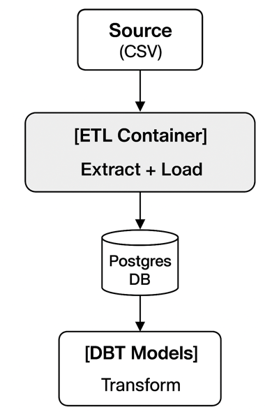

## Dockerized ELT Pipeline – CoreDataEngineers
### 📌Overview

This project demonstrates a fully managed ELT pipeline using Docker.
The pipeline consists of three containers/services:

1. **Python (ETL)** → Extracts CSV data from a URL and loads it into Postgres.
2. **Postgres** → Staging database to hold raw and transformed data.
3. **DBT** → Transforms the staged data into a clean analytics model.

The pipeline is scheduled to run **daily at 12:00 a.m.** using a cron job.

## 🏗 Architecture

## 📂 Project Structure

## ⚙️ Prerequisites
- Docker & Docker Compose installed
- PostgreSQL client (optional, for testing)

## 🚀 Running the Pipeline
### 1. Build & Start Containers
docker-compose up --build

This will:
- Start Postgres
- Run the Python ETL (extract + load)
- Run DBT (transform data)

### 2. Verify Data

You can connect to Postgres locally:

psql -h localhost -U user -d posey

### 3. Schedule Daily Run

Edit crontab with crontab -e and add:

0 0 \* \* \* /home/l/etl-pipeline-docker/scripts/run_pipeline.sh >> /home/l/etl-pipeline-docker/logs/pipeline.log 2>&1

This ensures the pipeline runs every midnight.

## 📊 Logging

View logs for each container:

docker logs <container_id>

## 📈 Dashboard

For visualization, you can connect BI tools (e.g., Metabase, Superset, dbt docs) to the Postgres database.
